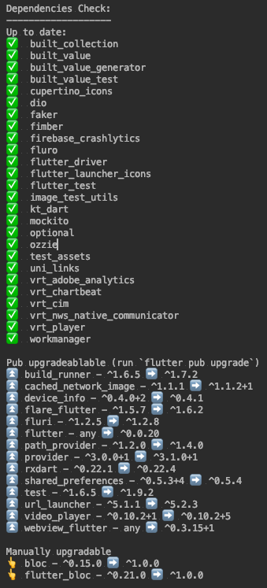

[](https://pub.dartlang.org/packages/dep_check)

# Pub Dev Dependencies Checker

Checks if your dependencies are up to date in your `pubspec.yaml`. 



# :book: Installation

```shell
pub global activate dep_check
```

In your desired project go and enter.

```shell
pub global run dep_check
```
